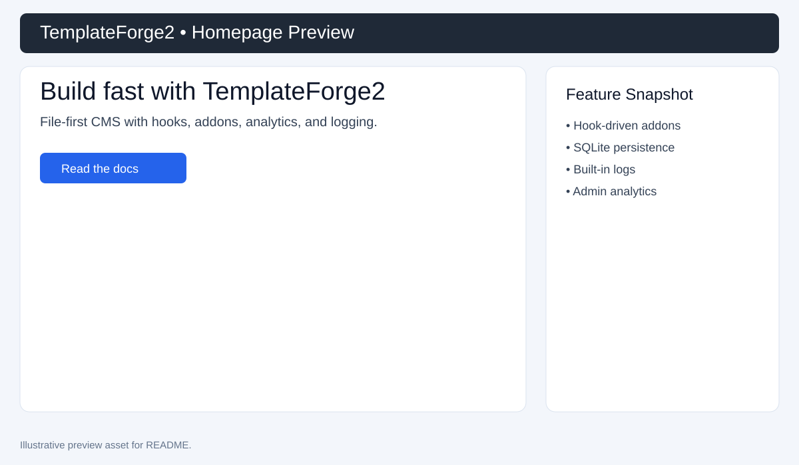
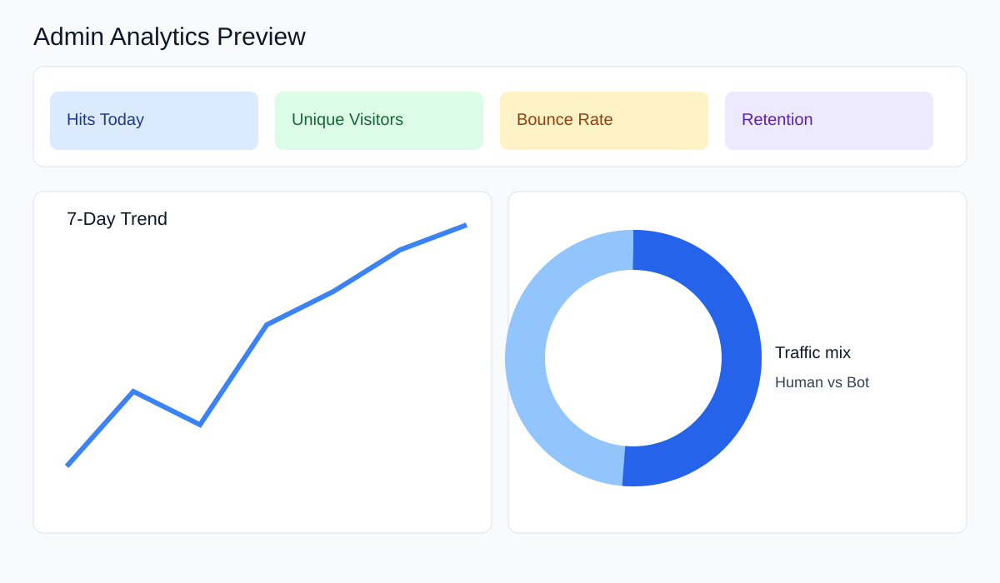
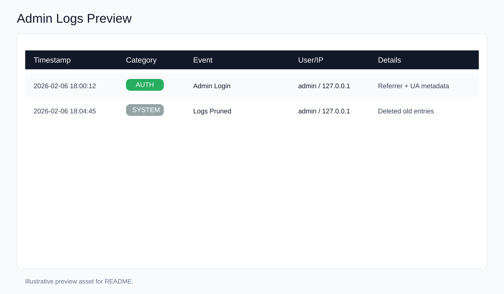

# TemplateForge2

> A lightweight, file-first PHP CMS + blog engine with a modern admin panel, SQLite storage, addon hooks, activity logging, and built-in analytics.

---

## ✨ Why TemplateForge2?

TemplateForge2 keeps deployment simple (single PHP app + SQLite) while still offering the controls you usually need in production:

- **Content pages + blog posts** with slug-based routing.
- **Admin panel** for dashboard, pages, blog, settings, navigation, users, analytics, and logs.
- **Hook engine** for pluggable addons (`add_hook()` / `run_hook()`).
- **Activity logging** across auth and system events.
- **Visitor analytics + traffic stats** (referrer groups, devices, trends, retention).

---

## 🧱 Architecture at a glance

### Request entry points
- `index.php`: main page routing + template rendering.
- `blog.php`: blog listing/filtering.
- `post.php`: single post rendering.
- `admin/index.php`: authentication gate + module router.

### Core services
- `functions.php`
  - `log_activity(...)` for structured activity logs.
  - `track_visit(...)` for traffic tracking and visitor fingerprinting.
  - `get_site_settings(...)` shared settings loader.
- `includes/hooks.php`
  - `add_hook($name, $callback)` to register addon behavior.
  - `run_hook($name)` to execute all callbacks for a location.

### Storage
- SQLite database at `db/cms.db`.
- Installer bootstraps schema and seed content via `Install.php`.

---

## 📊 Logging, stats, and hooks (deep dive)

### 1) Activity logging
Logging is centralized in `log_activity(...)` and writes to the `logs` table with:

- category
- event
- enriched details (`Details + Referrer + UA`)
- user context
- IP address
- timestamp

In admin, the **Logs** module supports:
- category filtering
- latest-first inspection (up to 500 rows)
- one-click pruning of entries older than 7 days

### 2) Analytics + stats
`track_visit(...)` records:
- `visitor_id` (SHA-256 fingerprint of IP + user agent)
- page URL
- referrer
- browser / OS classification
- device classification (mobile vs desktop)

The **Analytics** module computes and visualizes:
- page views today + day-over-day trend
- unique visitors
- bounce rate
- returning visitor retention
- browser/device distributions
- traffic type split (human vs bot-like signatures)
- referrer source groups (Direct / Search / Social / Referral)
- top pages + hourly and weekly trends

### 3) Hook system (addons)
Hook registration is global and intentionally simple:

- Addons call `add_hook('hook_name', $callback_or_html)`.
- Templates/admin invoke `run_hook('hook_name')`.
- Callback hooks and raw HTML injection are both supported.

This makes feature extension straightforward without editing core templates for every customization.

---

## 🖼️ Visual preview

> Note: live browser-container screenshot capture was attempted in this environment, but container routing returned a `Not Found` page. The previews below are illustrative assets added to make the README visual and informative.

### Homepage


### Admin analytics


### Admin logs


---

## 🚀 Quick start

### Requirements
- PHP **8.0+**
- `pdo_sqlite` extension
- Writable directories: `db/`, `uploads/`

### Run locally
```bash
php -S 0.0.0.0:8000
```

Then open:
- `http://localhost:8000/Install.php`
- `http://localhost:8000/`
- `http://localhost:8000/admin/`

---

## 🔐 Security testing (requested)

Security-focused checks run during this update included:

1. PHP syntax lint across the codebase.
2. Dangerous-function scan (`eval`, `exec`, `shell_exec`, etc.).
3. Debug exposure scan (`display_errors`, permissive `error_reporting`).
4. SQL query pattern scan (`prepare()` coverage vs raw query usage).
5. CSRF token usage scan for state-changing forms.

### High-level findings

**Strengths**
- PDO prepared statements are widely used in auth/CRUD flows.
- Password handling uses `password_hash()` and `password_verify()`.
- Installer includes setup-token + CSRF checks.

**Hardening opportunities**
- Keep debug output disabled in production entry points.
- Expand CSRF coverage to all mutating admin/contact actions.
- Keep installer route blocked after setup (`admin/lock` + webserver deny rule).
- Consider stricter allowlisting in admin module routing.

---


## 🛣️ Feature roadmap ideas

For a prioritized list of proposed improvements, see [`docs/feature-enhancements.md`](docs/feature-enhancements.md).

---

## 📁 Directory map

```text
TemplateForge2/
├── index.php
├── blog.php
├── post.php
├── Install.php
├── functions.php
├── includes/
│   ├── hooks.php
│   └── css-registry.php
├── addons/
├── templates/
├── sidebars/
└── admin/
```

---

## 📜 License

This project is licensed under the **MIT License**. See `LICENSE`.
